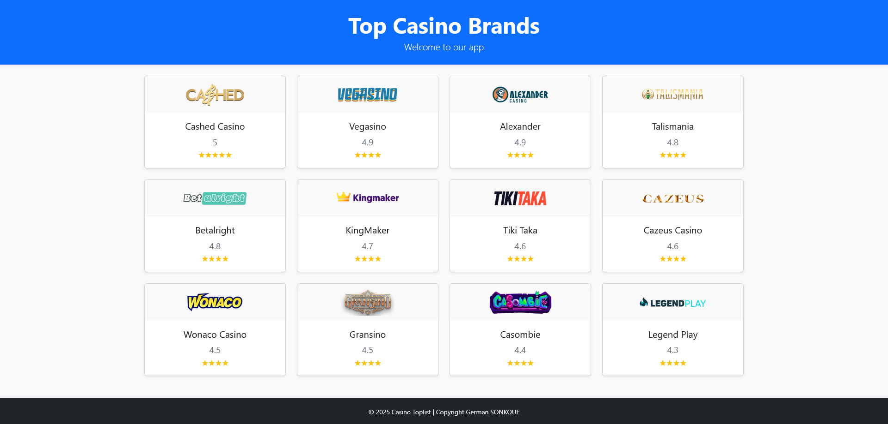
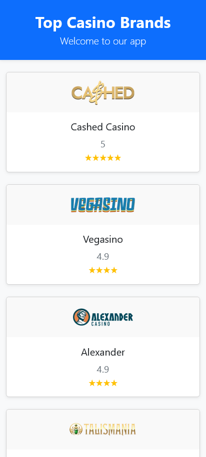

# Brand Toplist Frontend

A professional frontend project for displaying and managing brand toplists. Built with **HTML**, **Bootstrap 5**, and **JavaScript** for a responsive and interactive user experience.

## Features

- Responsive design using Bootstrap 5
- Dynamic brand listing and management
- Modern UI/UX principles
- Easy integration with backend APIs

## Technologies Used

- **HTML5**
- **Bootstrap 5**
- **JavaScript (ES6+)**

## Getting Started

1. Clone the repository:
    ```bash
    git clone https://github.com/helroygerman/brand-toplist-frontend.git
    ```
2. Open `index.html` in your browser.

## Docker Deployment

You can deploy the frontend using Docker for easy setup and portability.

1. **Build the Docker image:**
    ```bash
    docker build -t brand-toplist-frontend .
    ```
2. **Run the container:**
    ```bash
    docker run -d -p 8080:80 brand-toplist-frontend
    ```
3. Open your browser and navigate to `http://localhost:8080`.

**Sample `Dockerfile`:**
```dockerfile
# Use an official Nginx image to serve static files
FROM nginx:alpine
COPY . /usr/share/nginx/html
```

## Screenshots





## Folder Structure

```
/
├── index.html
├── css/
│   └── styles.css
├── js/
│   └── main.js
└── screenshots/
     └── screenshot1.png
```

## License

This project is licensed under the [MIT License](LICENSE).

## Contact
Developer : German SONKOUE
For questions or feedback, please contact [yimhelgerman@gmail.com](mailto:yimhelgerman@gmail.com).